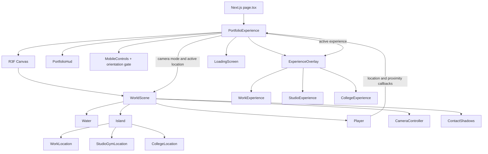
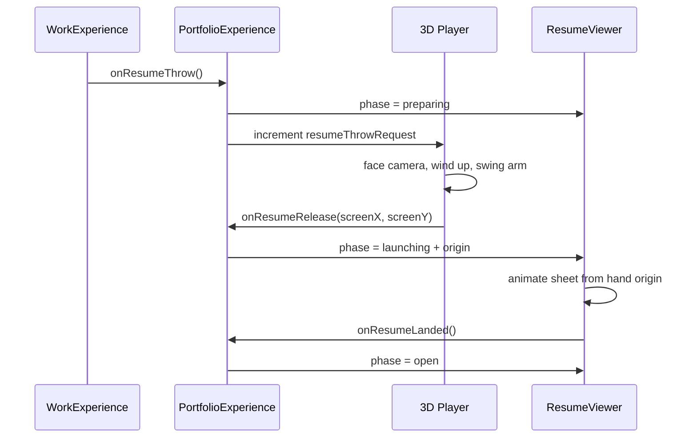

# How This Interactive Portfolio Was Created

This project turns a traditional software engineering portfolio into a small playable 3D island. The visitor moves a character between three landmarks, opens location-specific experiences, and reads the portfolio through interfaces layered over the world.

The implementation deliberately stays compact. It is not a general-purpose game engine: it is a handcrafted React application with a Three.js scene, a small camera state machine, simple geometric collision, and DOM-based content panels.

## Technology Stack

| Layer | Technology | Purpose |
| --- | --- | --- |
| Application | Next.js 16.3.4 App Router | Page shell, metadata, fonts, production build |
| UI | React 19.2.8 | State, events, overlays, and component composition |
| Language | TypeScript 5 | Shared contracts for world and portfolio data |
| 3D rendering | Three.js 0.185.1 | Geometry, materials, vectors, projection, and math |
| React 3D layer | React Three Fiber 9.7.0 | Declarative Three.js scene and frame loop |
| 3D helpers | Drei 10.7.8 | Contact shadows and cursor behavior |
| Styling | Tailwind CSS 4 plus custom CSS | Tailwind pipeline with a bespoke visual system |
| Icons | Phosphor Icons 2.1.10 | Interface controls and content symbols |
| Audio | Web Audio API | Procedural ambience and interaction sounds |

The site uses `next/font` for Instrument Sans and IBM Plex Mono. Most visual styling lives in `src/app/globals.css`; Tailwind is available, but the finished interface primarily uses custom classes and CSS variables.

## High-Level Architecture



`PortfolioExperience` is the coordinator. It owns discrete application state, while the R3F components own continuously changing animation values in refs. This separation avoids rerendering the React tree every frame.

## Project Structure

```text
src/
  app/
    layout.tsx                 Fonts, metadata, and global CSS
    page.tsx                   Route entry
    globals.css                Complete visual system and animation CSS
  components/
    portfolio/
      PortfolioExperience.tsx  Root state and 3D/UI coordination
    world/
      WorldScene.tsx           Scene graph assembly
      Island.tsx               Terrain, paths, props, and landmarks
      Player.tsx               Movement, gait, and resume throw animation
      WorldActivities.tsx      Playground slide geometry
      CameraController.tsx     Intro/follow/experience camera state machine
      InteractiveDoor.tsx      Reusable animated door interaction
      Water.tsx                Animated ocean surface
      WorldSignage.tsx         Floating labels and location signage
      locations/
        WorkLocation.tsx
        StudioGymLocation.tsx
        CollegeLocation.tsx
    experiences/
      ExperienceOverlay.tsx    Shared full-height content panel
      WorkExperience.tsx       Experience, toolkit, resume, and contact tabs
      StudioExperience.tsx     Athletic and leadership content
      CollegeExperience.tsx    Education and project browser
      ProjectPresentation.tsx  Individual project case study
    ui/
      PortfolioHud.tsx         Brand, location, sound, and interaction prompt
      MobileControls.tsx       Touch joystick, action button, and orientation gate
      WorkoutHud.tsx           Gym exercise controls, queue status, and rep counts
      LoadingScreen.tsx        Initial scene transition
      WebGLFallback.tsx        Canvas fallback
  data/
    world.ts                   Coordinates, collision, proximity, camera targets
    portfolio.ts               Resume-derived content and project data
    theme.ts                   Shared 3D colors
  hooks/
    useMovementControls.ts
    useAmbientAudio.ts
    useReducedMotionPreference.ts
public/
  Jayesh_Rajani_Resume.pdf
  Jayesh_Rajani_Resume-preview.png
  project-banners/
```

## 1. Application Shell

`src/app/page.tsx` renders one component: `PortfolioExperience`.

The root layout in `src/app/layout.tsx` provides:

- site metadata
- safe-area viewport coverage
- the sans and monospace fonts
- global CSS
- the HTML and body shell

`PortfolioExperience` is a client component because it owns browser events, sound, React state, and the WebGL canvas. Keeping the App Router page itself small preserves a clear server/client boundary.

## 2. The R3F Canvas

`PortfolioExperience` creates one React Three Fiber `Canvas` with:

- a perspective camera
- antialiasing
- capped device pixel ratio for performance
- PCF shadows
- ACES filmic tone mapping
- a `WebGLFallback`

`WorldScene` then assembles the actual scene:

```text
WorldScene
  background + fog
  ambient, hemisphere, and directional lights
  Water
  Island
  Player
  ContactShadows
  CameraController
```

React Three Fiber calls each component's `useFrame` callback before rendering a frame. Movement, water motion, doors, player articulation, and camera interpolation use this loop.

## 3. Building the Island

The island is procedural but intentionally simple.

`WORLD.islandOutline` in `src/data/world.ts` is an array of two-dimensional `[x, z]` points. `Island.tsx` converts those points into a `THREE.Shape`, then uses stacked `extrudeGeometry` meshes for:

1. the lower rock edge
2. a sand band
3. the grass surface

Slightly different scales, depths, and materials create the layered coastline. Fog and directional lighting give the low-poly forms depth without image-based lighting or downloaded 3D models.

Paths are generated from point arrays. Each path segment becomes a shallow box whose:

- position is the midpoint between two points
- length is the distance between those points
- Y rotation comes from `Math.atan2`

Trees and rocks are repeated primitive meshes placed from constant coordinate arrays. The complete island therefore uses boxes, cylinders, polyhedra, and extrusions rather than external GLTF models.

## 4. Landmark Components

Each destination is its own component:

- `WorkLocation`
- `StudioGymLocation`
- `CollegeLocation`

A landmark component owns its building geometry, material choices, decorative details, sign, and door placement. It does not decide whether its experience is open. The parent `Island` passes three values:

- whether the player is near its interaction point
- whether that destination is currently open
- the callback used when its door is activated

All landmarks share `InteractiveDoor`. The door uses a hinge group and frame-by-frame damping to rotate smoothly. It only accepts a click while its destination is active, so clicking distant geometry cannot bypass proximity rules.

The bench, black mat, and white training frame are rendered inside `StudioGymLocation`, so the workout remains part of the existing Studio / Gym destination rather than appearing as another world location. `WorldActivities` owns only the playground slide.

## 5. World Data, Coordinates, and Collision

`src/data/world.ts` is the source of truth for world layout.

### Landmark anchors

`LANDMARK_POSITIONS` places each building group in world space. Moving a landmark requires updating its related path, collider, interaction point, and camera target as one contract.

### Walkable island

`isWalkable(x, z)` first uses a point-in-polygon test against the island outline. It then rejects positions that overlap one of the rectangular building colliders.

Movement collision is resolved one axis at a time:

```ts
if (isWalkable(candidateX, currentZ)) moveX();
if (isWalkable(currentX, candidateZ)) moveZ();
```

This gives the character a natural sliding response along walls without introducing a physics engine.

### Location awareness

`WORLD_LOCATIONS` defines a label, center, and radius for each area. `getLocationAt` selects the closest matching area and updates the HUD when the player crosses a boundary.

### Interaction zones

`INTERACTION_TARGETS` contains:

- destination ID and prompt label
- door approach coordinate
- interaction radius
- experience camera position
- experience camera look target

`getNearbyInteraction` returns the nearest target inside its radius. This value controls the door highlight, HUD prompt, Enter-key action, and active destination.

## 6. Player Movement and Articulation

`useMovementControls` records pressed WASD and arrow keys in a `Set`. A ref is used instead of React state so key changes do not rerender the application.

For touch devices, `PortfolioExperience` owns a second mutable movement ref. `MobileControls` reports a normalized horizontal and vertical vector through a stable callback, and `Player` combines that vector with the keyboard state. Keeping both input sources in refs avoids React updates during a drag.

The joystick applies a small dead zone, clamps the knob to its circular travel radius, and preserves analog magnitude so a partial drag moves the character more slowly. Pointer capture keeps the gesture active when the finger leaves the joystick, while pointer up, pointer cancel, lost capture, disabled state, and component cleanup all reset movement to zero.

Space increments a one-shot hop request. `Player` consumes each request once, moves the character root through a sine-eased vertical arc, and blends the arms and legs into an airborne pose. Horizontal steering remains available during the hop.

Inside `Player`:

1. The current camera direction is flattened onto the ground plane.
2. A perpendicular right vector is calculated.
3. Horizontal and vertical input are combined into a camera-relative direction.
4. Analog input magnitude scales the player's speed.
5. The candidate position is tested against `isWalkable`.
6. The character rotates toward the movement direction with angular damping.

The character is assembled from primitive meshes under an articulated group hierarchy. Separate refs control the torso, head, arms, upper legs, lower legs, and feet.

The walking cycle is distance-driven rather than time-driven. Distance moved advances `gaitPhase`, which means the feet stop when the character stops and do not appear to slide while blocked. Sine waves create alternating strides, knee bends, foot correction, arm counter-swing, torso rotation, and step lift.

Footstep audio is emitted each time the gait crosses the next half-cycle.

### Scripted activities

Slide traversal and Gym positioning use the same frame loop as walking. While one of these actions is active, free movement is disabled and a single timeline owns the player position and pose. The slide timeline eases through approach, alternating ladder steps, a short settle, seated descent, and recovery before returning control.

Gym input is queue-based. Each non-repeated S, D, or B keydown appends exactly one squat, deadlift, or bench-press request. `Player` completes one smooth pose cycle at a time and reports completion to `PortfolioExperience`; only then is the corresponding rep counter incremented and the next request started. This prevents rapid key presses from restarting or blending competing animations.

## 7. Camera State Machine

The camera supports five modes:

```text
INTRO -> FOLLOW -> ENTER -> EXPERIENCE -> EXIT -> FOLLOW
```

`CameraController` implements these modes without a separate animation library.

- `INTRO`: moves from the opening overview toward the player.
- `FOLLOW`: damps toward `playerPosition + cameraOffset`.
- `ENTER`: interpolates from the current camera pose to the destination target.
- `EXPERIENCE`: holds the landmark composition behind the content panel.
- `EXIT`: returns to the follow camera.

Each transition records its starting camera position and look target. A smoothstep curve interpolates both values. When a transition reaches one, `onTransitionComplete` tells `PortfolioExperience` to advance the application state.

This keeps camera animation deterministic and prevents the content panel from opening before the cinematic move finishes.

## 8. Interaction and State Flow

The player calculates location and proximity continuously, but only reports a change when an ID changes. `PortfolioExperience` stores the resulting discrete state:

- `worldReady`
- `cameraMode`
- `currentLocation`
- `nearbyInteraction`
- `openLocationId`
- active slide or Gym session
- queued workout requests and completed rep counts
- resume throw phase and origin

A destination opens only when:

- the camera is in `FOLLOW`
- the player is within the matching interaction radius
- Enter, Numpad Enter, the HUD prompt, the mobile `OPEN` action, or the active door is used

Opening a destination changes the camera to `ENTER`. Once the transition finishes, the mode becomes `EXPERIENCE`, and `ExperienceOverlay` renders the matching panel.

Escape reverses the process through `EXIT`. The resume dialog captures Escape first so closing the resume does not also close the Work experience.

## 9. DOM Experiences Over the 3D World

The content-heavy sections remain normal HTML instead of being rendered into WebGL. This keeps text selectable, links accessible, layouts responsive, and content easy to maintain.

`ExperienceOverlay` supplies the common panel shell and chooses one of three experiences:

### Work

`WorkExperience` contains four tabs:

- Experience
- Toolkit
- Resume
- Contact

The content comes from `src/data/portfolio.ts`. Contact rows use real links for email, phone, LinkedIn, and GitHub.

### Studio / Gym

`StudioExperience` presents athletic competition and community leadership data from `athleteProfile`, plus a direct Instagram profile card sourced from `instagramProfile`. The card links out to the real profile without embedding Instagram or inventing social metrics. In the 3D world, approaching the bench activates the Gym session: S queues squats, D queues deadlifts, B queues bench presses, and Escape exits.

### Learning Loop

`CollegeExperience` combines education data with a project selector. `ProjectPresentation` renders the active project's image, problem, solution, technology, architecture, result, and source link.

## 10. The 3D-to-DOM Resume Throw

The resume interaction bridges the Three.js scene and the HTML interface.

The flow is:



The player holds a small resume mesh under the throwing arm. At the release frame, Three.js projects that mesh's world position through the active camera:

```ts
worldPosition.project(camera);
```

The normalized device coordinate is converted to viewport pixels. Those values become CSS custom properties for the DOM sheet's animation origin.

The same DOM sheet remains mounted through launch and landing. This avoids a visible remount, blank embedded-PDF frame, or scale snap. The landed view uses the rendered resume preview; Open PDF and Download remain explicit actions.

## 11. HUD, Loading, and Fallbacks

`PortfolioHud` displays:

- identity and role
- current world location
- ambient sound toggle
- nearby interaction prompt
- movement instructions

Desktop movement hints are hidden on coarse pointers. In landscape, `MobileControls` places a translucent 112px joystick at the lower left and a contextual `OPEN` button at the lower right. Both use safe-area insets so they clear device cutouts and home indicators.

`WorkoutHud` appears within an active Gym session. It provides keyboard-labelled exercise buttons that are also tappable, reports the queued rep count, and maintains separate completed counts alongside the total.

Portrait touch screens show `MobileOrientationGate` instead of the controls. This is a CSS media-query gate rather than a browser orientation lock, because ordinary web pages cannot reliably force device orientation. Desktop and fine-pointer devices are unaffected.

`LoadingScreen` waits for the Canvas `onCreated` callback, then transitions away. It is a scene-ready indicator, not byte-level asset progress.

`WebGLFallback` is supplied to the Canvas, and a separate `<noscript>` message covers browsers with JavaScript disabled.

## 12. Procedural Audio

`useAmbientAudio` builds sound with the Web Audio API instead of loading audio files.

It creates filtered noise and oscillators for:

- surf and wind ambience
- coastal bird calls
- footsteps
- door movement
- enter and exit transitions
- proximity and location cues

Audio is initialized lazily after the visitor enables sound. This follows browser autoplay restrictions and avoids creating an audio context before user interaction.

## 13. Styling and Motion

`src/app/globals.css` defines the design system:

- palette and surface variables
- typography hierarchy
- HUD and prompt placement
- experience panel layout
- responsive breakpoints
- resume flight animation
- loading transitions
- reduced-motion and reduced-transparency behavior

The world and interface share the same restrained colors from `src/data/theme.ts` and CSS variables, which makes the WebGL and DOM layers feel like one product.

Continuous 3D motion uses `useFrame` and Three.js interpolation. Interface transitions use CSS. This keeps each animation in the rendering system best suited to it.

## 14. Accessibility and Motion Preferences

The implementation includes:

- semantic dialog roles for experience and resume overlays
- accessible labels on icon controls
- keyboard interaction with Enter and Escape
- pointer capture and a labeled touch joystick
- a dialog-style portrait orientation notice for touch screens
- `aria-live` status updates
- visible focus states
- a WebGL fallback
- a no-JavaScript fallback
- `prefers-reduced-motion` support
- `prefers-reduced-transparency` support

`useReducedMotionPreference` listens to the media query and passes the result into the water, player, and camera. Essential movement remains understandable while decorative bobbing and long transitions are reduced.

## 15. Content and Asset Strategy

Portfolio copy is centralized in `src/data/portfolio.ts`. The components consume typed data rather than embedding resume content throughout the UI.

The public assets are:

- the downloadable resume PDF
- a rasterized resume preview
- one banner image per project

They live under `public/`, so Next.js serves them from root-relative URLs. `next/image` handles the resume preview and project banners.

`assets.json` records asset provenance. Any external asset added later should be recorded there.

## 16. Rebuilding It From Scratch

A reliable construction order is:

1. Scaffold a Next.js App Router project with TypeScript.
2. Install Three.js, React Three Fiber, Drei, and Phosphor Icons.
3. Add fonts, metadata, global colors, and the full-viewport page shell.
4. Define portfolio content in `portfolio.ts`.
5. Define the island outline, landmark anchors, collisions, locations, and interaction targets in `world.ts`.
6. Create the Canvas and static `WorldScene` lighting/fog setup.
7. Build the extruded island, water, paths, trees, and rocks.
8. Build each landmark from primitive meshes and add shared doors/signage.
9. Add camera-relative keyboard and analog movement, hopping, and collision to `Player`.
10. Add the distance-driven articulated walk cycle.
11. Implement the camera mode state machine.
12. Connect proximity, Enter/click interaction, camera transitions, and overlays in `PortfolioExperience`.
13. Build the Work, Studio/Gym, and Learning Loop HTML experiences.
14. Add the 3D-to-DOM resume throw only after player and camera behavior are stable.
15. Add scripted slide traversal and the queued Gym exercise state machine.
16. Add the landscape touch controls, safe-area spacing, and portrait orientation gate.
17. Add procedural audio, reduced-motion behavior, loading UI, and fallbacks.
18. Test every path, door, activity, camera target, and overlay on desktop and a landscape touch viewport.

## 17. Adding or Moving a Destination

Treat a destination as one coordinated contract. Update all of the following together:

1. `LANDMARK_POSITIONS`
2. the landmark component's geometry and door position
3. `WORLD.buildingColliders`
4. `WORLD_LOCATIONS`
5. `INTERACTION_TARGETS`
6. the path points in `Island.tsx`
7. the experience mapping in `ExperienceOverlay`

Afterward, walk to the destination from the spawn point and verify:

- the path reaches the door
- the player cannot walk through the building
- the location label changes correctly
- the prompt appears at the door
- Enter and click open the intended content
- the focus camera frames both the landmark and panel cleanly

## 18. Adding a Project

Add a typed entry to `projects` in `src/data/portfolio.ts` with:

- ID and title
- short description
- problem and solution
- technology and architecture
- result
- GitHub URL
- banner path and alternative text

Place the banner in `public/project-banners/`. `CollegeExperience` builds its selector from the array automatically, and `ProjectPresentation` renders the selected entry.

## 19. Local Development and Validation

Install and run:

```bash
npm install
npm run dev
```

Open `http://localhost:3000`.

Before publishing a change:

```bash
npm run typecheck
npm run lint
npm run build
```

The app uses the standard Next.js production runtime and can be deployed to Vercel or another Node-compatible host. No database, CMS, API key, or server-side data source is required.

## 20. Practical Constraints

The current architecture is intentionally optimized for one small world:

- collision uses a polygon and rectangular building bounds, not a physics engine
- navigation is manual; there is no pathfinding or navmesh
- state is in memory; refreshing resets the player and open location
- the loading screen is not a true asset-progress meter
- the resume throw depends on the current camera and viewport projection
- touch gameplay is intentionally landscape-first; portrait touch screens ask the visitor to rotate
- orientation is recommended through the UI rather than forcibly locked by the browser

If the island grows substantially, the first systems to revisit should be collision, destination configuration, asset loading progress, and automated interaction tests.
